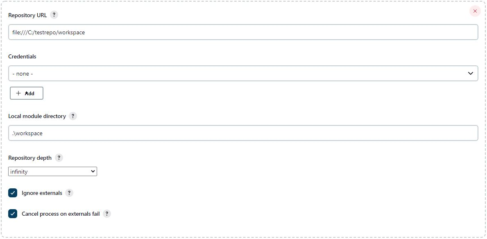

### Test Directory

This directory contains CICDScript test environment for various VCS usages. Will be updated
if a new VCS support is added.

# CI Test on an SVN repository

The "testrepo" directory is an SVN repository, representing a dummy CI/CD repository
containing the directories below:

| Directory Name | Description  |
| -------------- | ------------ |
| artifacts | This is the deployment point of the build artifact |
| base | This represents a directory which is not under CI check. It contains the file 'basetext.txt' which will be filled with the reference from 'reftext.txt' |
| production | This contains the CICDScript project files, which are CICDScript.py, CICDConfig.xml and Jenkinsfile. CICDConfig.xml and Jenkinsfile should be modified according to the test environment (repo location, Jenkins credential ID, email recipient list etc.). This directory will be defined in Jenkins as Jenkinsfile location.|
| ref | This represent a directory under CI check. It contains the file 'reftext.txt' which is the source of the reference needed by 'basetext.txt' |
| workspace | This represents the build workspace directory. It contains a build script "build.py" and a caller script "build.bat" which process the files mentioned above and produce an output text file. |

To create a test pipeline, create a Jenkins pipeline job and configure project SVN SCM settings using the repo-workspace locations as below:
(In here, Jenkins will access the repository with "file:///" protocol, so no authentication required, anyway you need to configure "vcscreds" 
credential parameter in "production/Jenkinsfile" as the Jenkins credential ID you use, in order to avoid pipeline errors. If authentication
takes place when accessing a remote repo, your Jenkins Credential ID must be the one which has the access rights to the repo.)

- "production" directory (Containing Jenkinsfile) :

- "ref" directory :

- "workspace" directory :

After configuring, start the pipeline manually for the first time. Jenkins will read the pipeline configuration from Jenkinsfile and will work
if any of the 3 repositories has a revision update.
